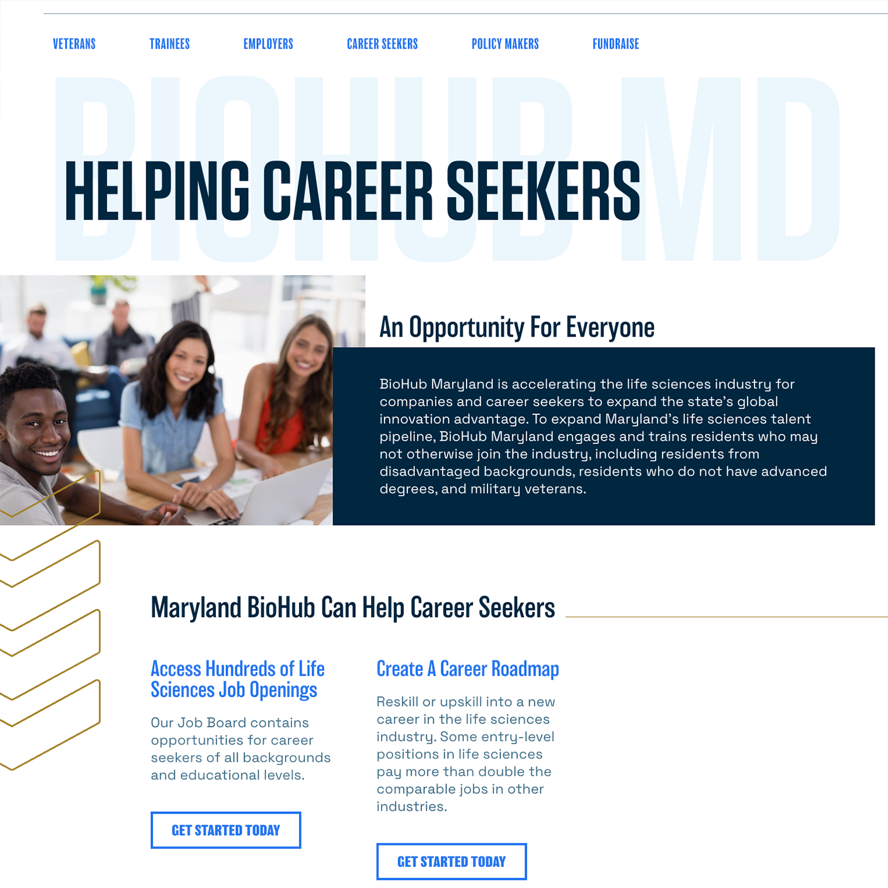
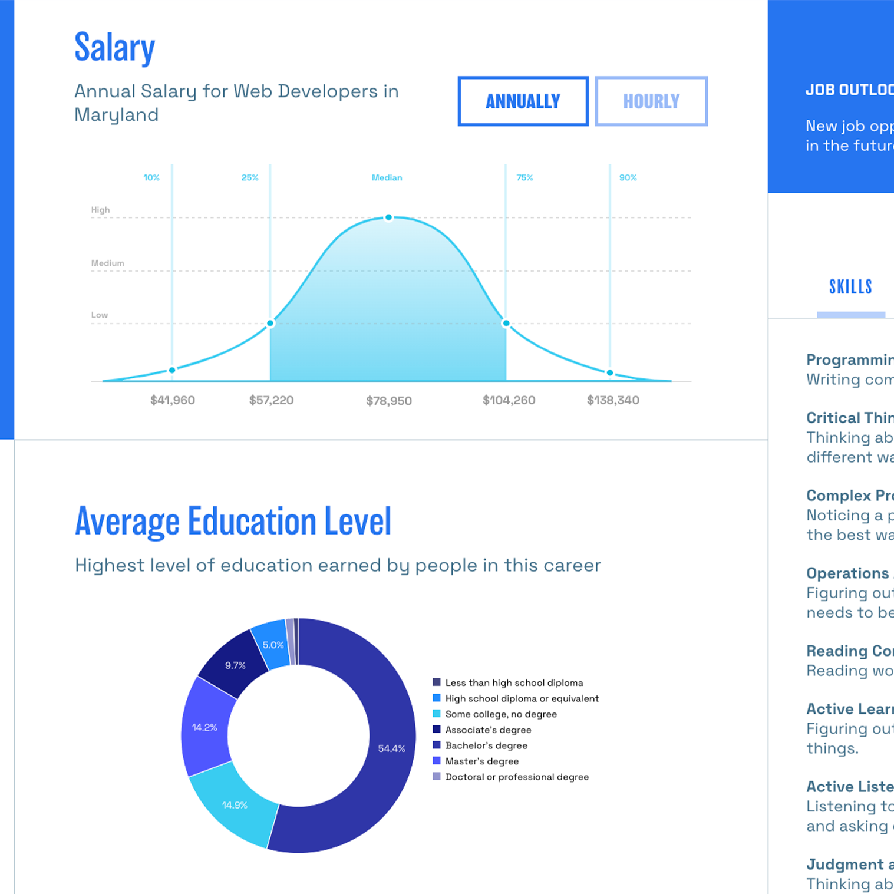

    [<i className="fa-solid fa-square-arrow-up-right"></i>](https://www.biohubmaryland.com "Link Out")

> BioHub Maryland helps connect life sciences companies with prospective employees of all backgrounds. As an initiative of Maryland Tech Council, the largest technology and life sciences trade association in Maryland, they are a large force in placing jobs in the state.

## Big Design
As the design was being created, the feedback from the client was to make text larger, put more embellishments on the page, make it feel big. So that is what we did! This site was a challenge mostly  in component functionality and responsive styling. 

    
    

## Project Highlights

- Multiple mini sliders within larger sliders
- Text highlighting on page scroll
- Sidebar navigation
- Large variety of component options
- Sticky top navigation on certain pages
- Chart generation using C3.js

    

## Dream Job
The heaviest lift of this site was to build a job education search web app. It is for people that are pursuing a career to search for a job title and get relative information about that job. We used an API called Career One Stop, which worked out perfectly. In order to limit API calls, I store the all of the data in the database, and set up a cron job in wordpress to update the data once a month. An auto-complete search field was used for the job search, and our designer did a great job putting the data into an infographic that lays out all of the details. I then brought that infographic to life for users to experience from their computers!