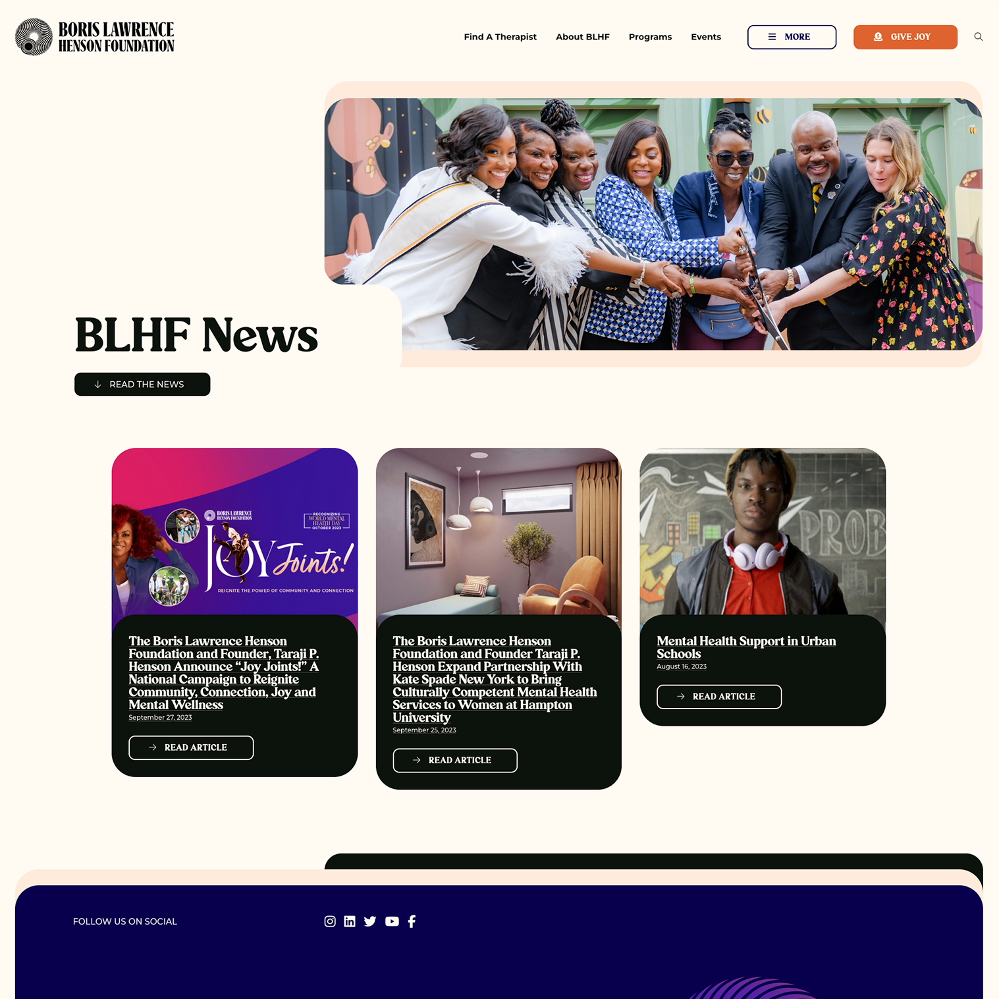
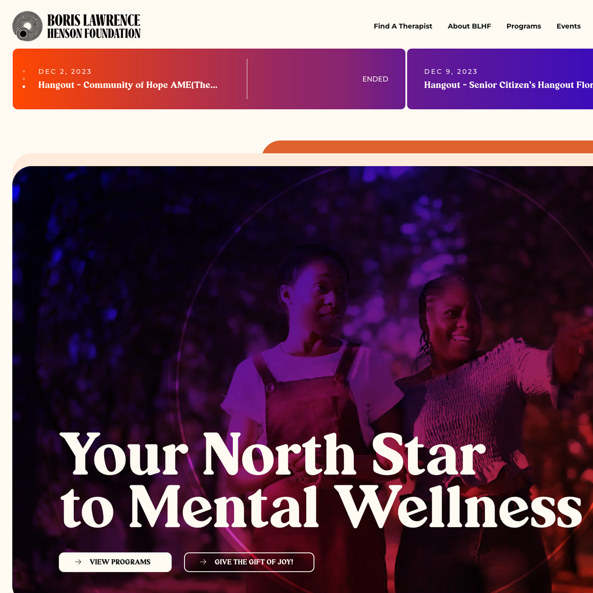
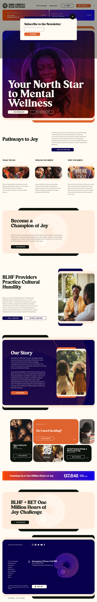

    [<i className="fa-solid fa-square-arrow-up-right"></i>](https://borislhensonfoundation.org "Link Out")

AMA MX Platinum Award Winner

> The Boris Lawrence Henson Foundation seeks to promote and provide mental health resources in Black communities. Boris Henson is the father of Taraji P Henson, an award-winning actress and author.

## Design Challenges
The client came to us with an outdated WordPress website that was bloated with unnecessary plugins and it was impacting site performance. They needed a more modern style, and wanted to be more proud showing it off. The designer did a great job and we collaborated on our UX visions for some of the more interactive elements. I was the lead developer on this project. I am proud of this site and I am grateful to be a part of any project that has such an important social message.

    
    

## Project Highlights
- Countdown timer within a slider for events
- Homepage Hero video background with a fixed headline and call to action buttons
- Hybrid navigation experience that puts traditional desktop navigation items in a dropdown as you shrink the screen width
- Curved elements throughout the site, in many places that required creative problem solving
- Animating backgrounds

    

    

