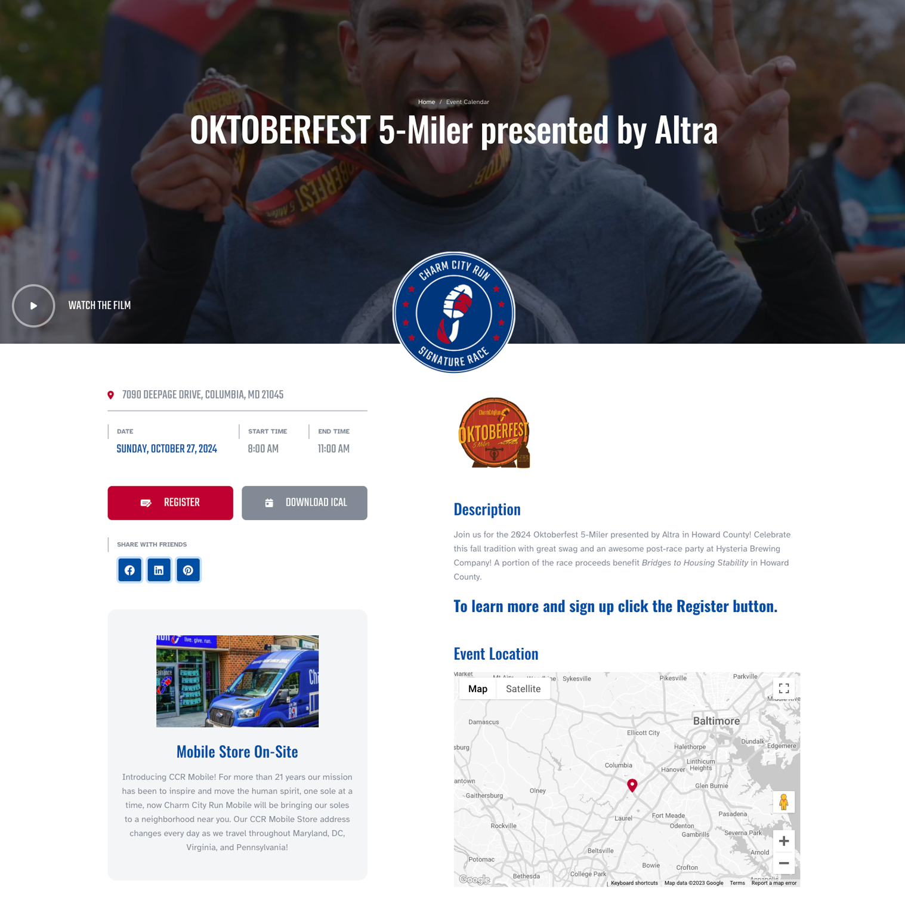
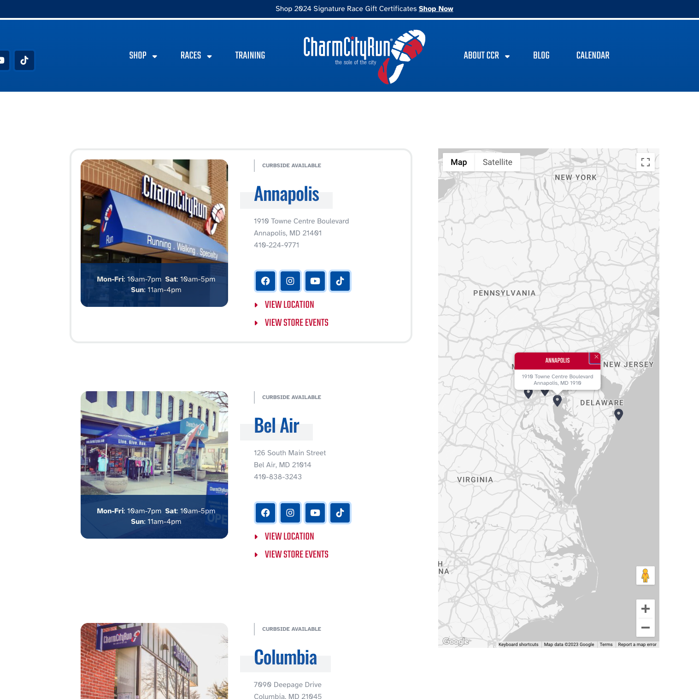
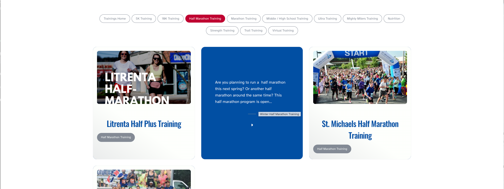
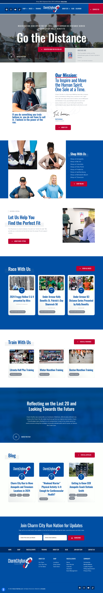

    [<i className="fa-solid fa-square-arrow-up-right"></i>](https://www.charmcityrun.com "Link Out")

> Charm City Run is the Baltimore Area’s specialty shoe shop. Hosting and sponsoring over 100 sports endurance events a year, they are a household name in the Baltimore Area.

## Moving From Squarespace
As Charm City Run grew, they started to realize that they needed to move their web presence away from Squarespace. They were sponsoring and hosting more events. They launched their recurring trainings and were having trouble managing them. They wanted a new look and decided it was time to move to WordPress with Duckpin. Our designer produced a more modern design and I was assigned to be lead developer. 

    
    

## Project Highlights
- SVG shoe prints behind targeted sections of the site that animate in a running pattern
- A custom store selector on that homepage triggering a waterfall of images changing
- Mega menu navigation
- A google map that updates the pin as you scroll past the locations

    

## Intense Data Coordination
A large part of this project was to provide solutions around data management. Coordinating locations, races and trainings was not working on their old system and it was time for an upgrade. I was in charge of the data architecture within WordPress, and the migration of existing data. We used an event plugin, Events Calendar Pro, for the events. It had to be heavily customized to feature a wide array of event types and individualized landing pages. Event venues and store locations were separate, so I wrote in code that updates the event venue when the location information changes. Hundreds of blog posts were migrated successfully. An enhanced event filtering plugin was utilized along with some custom column editing so the team at Charm City Run could quickly and accurately find the correct event to edit or duplicate. I personally fielded questions during the project, and at the end of the project I virtually walked the team through the system that I designed.

    

