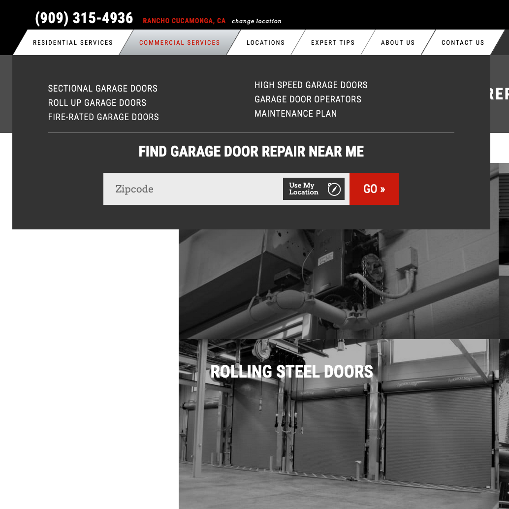

    [<i className="fa-solid fa-square-arrow-up-right"></i>](https://www.garagedoorrepair.com "Link Out")

> Garage Door Repair is a national search for garage door repair technicians run by a franchise owner of a popular garage door manufacturer, Overhead Door. You can type in your zip code or search for your area and you will be connected with your local Overhead Door licensed repair person.

## Admin Territory Mapping
The client came to us with a plan to rally Overhead Door franchise owners and manage a site that would get them leads. They all have territories that they cover made up of zip codes. I used a data mapping javascript tool called D3.js along with Mapbox to produce a visual map of all of the zip codes in the United States. This map is only for the owner to view, as it allows for them to visually select the territory boundary for each franchise owner. Each franchise is labeled with a different color and it is fully interactive.

    
    

## Project Highlights
- Current location geocoding
- D3.js mapping using GeoJSON data overlaying on MapBox maps
- Select a state interactive hover element
- Selected location stays with you when browsing the site

    

## Front End Searching
As the front-end user, you are able to find your nearest Overhead Door location by searching a few different ways. One way utilizes the browser’s native geolocation feature to get latitude and longitude coordinates to feed into the Google geolocation API to produce a zip code. The other way is to search by US county. You first select a state, then select a county and it takes you to the franchise page, with contact information and a form.

    

