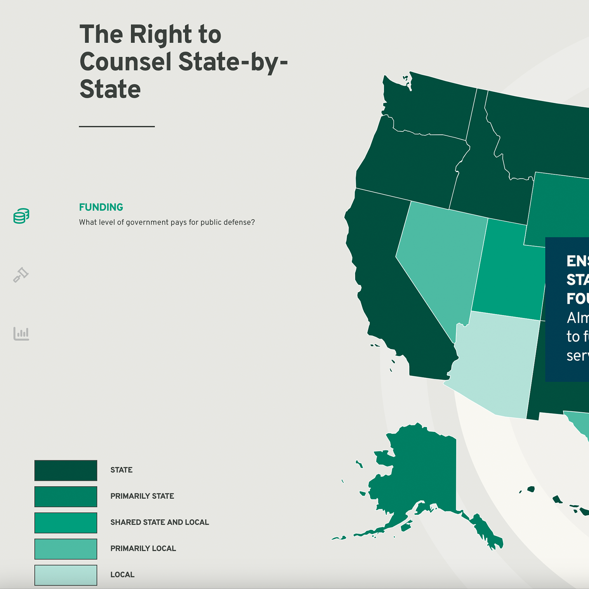
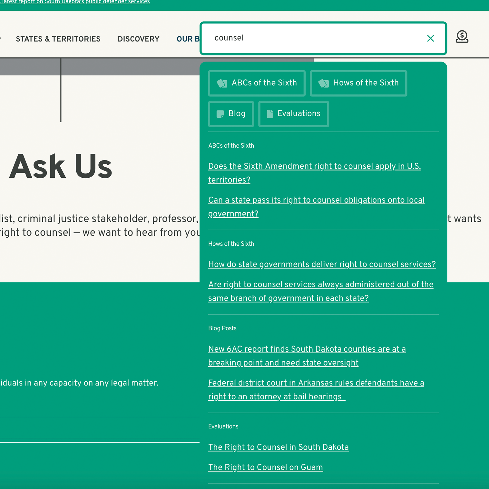
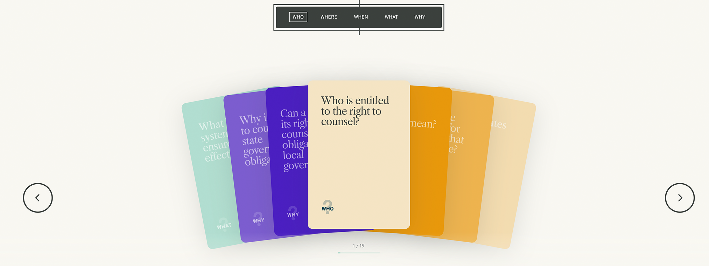
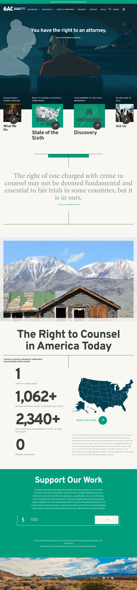

    [<i className="fa-solid fa-square-arrow-up-right"></i>](https://6ac.org "Link Out")

> Every US State is required to provide an attourney for those who cannot afford one under the Sixth Amendment of the Constitution. The ways that each State carry this requirement out often result in poor people not being able to use this right. The Sixth Amendment Center uses thier expert knowledge to help support policymakers navigate these legal complexities to improve thier indigent defense services.

## Outdated Site, Clean Execution
Their original site was built over 10 years ago, it did little to accurately represent who they were in this phase of thier companies history and they didn't have much autonomy to update it. They hired us to rebuild thier entire brand, which included a new website.  They needed many interactive educational tools to engage the viewer while learning this otherwise dense material. User experience was paramount to ensure anyone could use this site to quickly access information regardless of background. To future-proof everything I made sure everything was able to be updated and serviced by them in custom areas in the WordPress backend. I couldn't be more proud of this site. They shared my enthusiasm by showing it off to representatives in the highest levels of government, who gave it some great accolades.

    
    

## Project Highlights
- React-based flashcard viewer
- Interactive SVG map infographic
- React-based custom site search functionality
- Intricate design work that required advanced CSS skills
- React-based timeline feature

    

    

